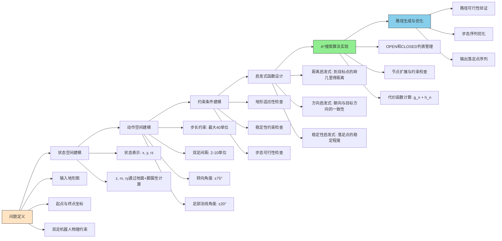

# 双足机器人路径规划问题流程与解决方案设计

## 问题定义与解决方案设计流程图



## 详细设计说明

### 1. 问题定义阶段

#### 输入要素

- **地形图**: 1000×3000的灰度图像，表示三维地形
- **起点与终点**: 二维坐标投影
- **物理约束**:
  - 最大步长40单位
  - 双足间距2-10单位
  - 最大转向角±75°
  - 足部法线角度±20°
  - 感知范围200×200区域

### 2. 状态空间建模

#### 状态表示

使用三元组(x, y, rz)定义一个脚的状态:

- **x, y**: 脚在地面上的投影坐标
- **rz**: 脚的朝向角（绕z轴旋转）

#### 隐式计算属性

- **z**: 脚的高度，通过地面高度查询获得
- **rx, ry**: 脚的倾斜角度，通过地面法线和脚的姿态计算获得

### 3. 动作空间建模

#### 基本动作

双足机器人交替移动左右脚，每一步移动一只脚到新位置:

- 步长不超过40单位
- 转向角度不超过±75°
- 落足点必须满足稳定性约束

### 4. 约束条件建模

#### 稳定性约束

- 足部法线与重力方向夹角小于±20°

#### 步态约束

- 步长不超过40单位
- 双足间距保持在2-10单位之间
- 转向角度不超过±75°

#### 感知约束

- 只能基于前方200×200区域的地形信息做决策

### 5. 启发式函数设计

#### 距离启发式

使用欧几里得距离估计到目标点的代价

#### 方向启发式

考虑机器人朝向与目标方向的一致性

#### 稳定性启发式

优先选择更稳定的落足点

### 6. A*搜索算法实现

#### 核心组件

- OPEN列表：待扩展的节点
- CLOSED列表：已扩展的节点
- 代价函数：f(n) = g(n) + h(n)

#### 节点扩展过程

1. 从OPEN列表中选择f(n)最小的节点
2. 检查是否到达目标点
3. 生成可行的后续动作
4. 对每个动作检查约束条件
5. 计算新节点的代价
6. 更新OPEN和CLOSED列表

### 7. 路径生成与优化

#### 输出结果

- 一系列满足约束条件的落足点序列
- 每个落足点包含(x, y, rz)信息

#### 后处理优化

- 验证路径的全局可行性
- 优化步态序列以提高效率

## A* 算法使用说明

## 简介

A*（A-Star）算法是一种常用的路径搜索算法，用于在图中找到从起点到终点的最优路径。它结合了Dijkstra算法的准确性和贪心最佳优先搜索的效率。

## 算法原理

A*算法使用一个启发式函数来指导搜索过程，通过评估函数f(n) = g(n) + h(n)来选择节点：

- g(n)：从起点到节点n的实际代价
- h(n)：从节点n到终点的估计代价（启发式函数）
- f(n)：从起点经过节点n到终点的总估计代价

## 使用示例

以下是如何使用我们实现的A*算法的示例：

```cpp
#include "aStar/aStar.hpp"
#include "aStar/graph.hpp"

int main() {
    // 创建图
    Graph graph;
    graph.graph = {
        {1, 1, 1, 1, 1},
        {1, 0, 1, 0, 1},
        {1, 0, 1, 0, 1},
        {1, 1, 1, 0, 1},
        {1, 1, 1, 1, 1}
    }; // 0表示障碍物，其他数字表示通过该点的代价
    
    // 创建A*算法实例
    AStar astar(graph);
    
    // 定义起点和终点
    Point start(0, 0);
    Point goal(4, 4);
    
    // 查找路径
    std::vector<Point> path = astar.findPath(start, goal);
    
    // 输出路径
    if (!path.empty()) {
        std::cout << "找到路径：" << std::endl;
        for (const Point& p : path) {
            std::cout << "(" << p.x << ", " << p.y << ")" << std::endl;
        }
    } else {
        std::cout << "未找到路径！" << std::endl;
    }
    
    return 0;
}
```

## 代码结构

- [aStar.hpp](file:///f:/library/Code/trapla/include/aStar/aStar.hpp)：A*算法的头文件，包含Point和Node结构体以及AStar类的定义
- [aStar.cpp](file:///f:/library/Code/trapla/src/aStar/aStar.cpp)：A*算法的具体实现
- [graph.hpp](file:///f:/library/Code/trapla/include/aStar/graph.hpp)：图的定义

## 算法特点

1. **最优性**：在启发式函数满足一定条件下，A*算法能够保证找到最优路径
2. **完整性**：只要存在解，A*算法就能够找到解
3. **时间复杂度**：取决于启发式函数的质量，最坏情况下为O(b^d)，其中b是分支因子，d是解的深度
4. **空间复杂度**：O(b^d)，需要保存所有生成的节点

## 启发式函数

本实现使用欧几里得距离作为启发式函数：

```math
h(n) = sqrt((x1-x2)² + (y1-y2)²)
```

根据具体应用场景，也可以选择其他启发式函数，如曼哈顿距离等。
