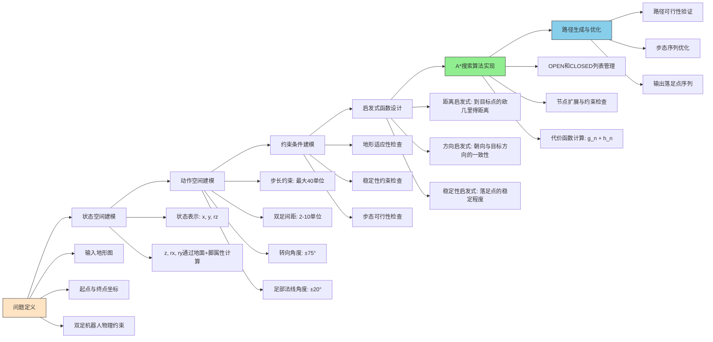

# 双足机器人路径规划问题流程与解决方案设计

## 问题定义与解决方案设计流程图

## 详细设计说明

### 1. 问题定义阶段

#### 输入要素

- **地形图**: 1000×3000的灰度图像，表示三维地形
- **起点与终点**: 二维坐标投影
- **物理约束**:
  - 最大步长40单位
  - 双足间距2-10单位
  - 最大转向角±75°
  - 足部法线角度±20°
  - 感知范围200×200区域

### 2. 状态空间建模

#### 状态表示

使用三元组(x, y, rz)定义一个脚的状态:

- **x, y**: 脚在地面上的投影坐标
- **rz**: 脚的朝向角（绕z轴旋转）

#### 隐式计算属性

- **z**: 脚的高度，通过地面高度查询获得
- **rx, ry**: 脚的倾斜角度，通过地面法线和脚的姿态计算获得

### 3. 动作空间建模

#### 基本动作

双足机器人交替移动左右脚，每一步移动一只脚到新位置:

- 步长不超过40单位
- 转向角度不超过±75°
- 落足点必须满足稳定性约束

### 4. 约束条件建模

#### 稳定性约束

- 足部法线与重力方向夹角小于±20°

#### 步态约束

- 步长不超过40单位
- 双足间距保持在2-10单位之间
- 转向角度不超过±75°

#### 感知约束

- 只能基于前方200×200区域的地形信息做决策

### 5. 启发式函数设计

#### 距离启发式

使用欧几里得距离估计到目标点的代价

#### 方向启发式

考虑机器人朝向与目标方向的一致性

#### 稳定性启发式

优先选择更稳定的落足点

### 6. A*搜索算法实现

#### 核心组件

- OPEN列表：待扩展的节点
- CLOSED列表：已扩展的节点
- 代价函数：f(n) = g(n) + h(n)

#### 节点扩展过程

1. 从OPEN列表中选择f(n)最小的节点
2. 检查是否到达目标点
3. 生成可行的后续动作
4. 对每个动作检查约束条件
5. 计算新节点的代价
6. 更新OPEN和CLOSED列表

### 7. 路径生成与优化

#### 输出结果

- 一系列满足约束条件的落足点序列
- 每个落足点包含(x, y, rz)信息

#### 后处理优化

- 验证路径的全局可行性
- 优化步态序列以提高效率

足部与地面接触部分代码设计思路

### 基本假设

假设：在足部接触地面发生偏转时，与地面接触面积不会发生改变。

### 计算方法

基于足部rz的值，计算出足部覆盖区域，再基于足部位置，能够获取到足部覆盖地形。
利用地形信息，计算出足部接触地面的偏转角度。

### 备选方案

备选参考方案为利用凸包检测算法，计算出足部覆盖区域，再基于足部位置，能够获取到足部覆盖地形。

### 当前设想

目前设想方案为通过在区域内遍历所有单元，不断更新三点计算平面，从而计算出足部相对偏转角度。

### 详细实现思路

#### 1. 足部覆盖区域计算

- 根据足部位置(x, y)和朝向角(rz)，计算足部矩形在地面坐标系中的实际覆盖范围
- 足部尺寸为3×5cm，需要考虑旋转后在地面网格上的实际覆盖区域
- 使用几何变换计算足部四个角点在世界坐标系中的位置
- 确定足部覆盖的所有地面网格单元

#### 2. 地面数据采样

- 遍历足部覆盖区域内的所有地面网格点
- 获取每个网格点的高度值，构建局部地形点云数据
- 对于部分在足部边界上的网格点，根据覆盖面积比例进行加权处理

#### 3. 接触平面计算

- 在足部覆盖区域内采用三点迭代算法计算最佳拟合平面
- 通过最小二乘法优化平面参数，使得平面与足部覆盖区域内的地面点尽可能贴合
- 计算足部坐标系与接触平面法向量之间的夹角，作为足部倾斜角度(rx, ry)

#### 4. 稳定性评估

- 检查足部法向量与重力方向的夹角是否超过±20°的限制
- 评估足部与地面的接触面积和压力分布
- 根据地面材质和摩擦系数计算足部的滑动风险

#### 5. 凸包检测备选方案

- 使用凸包算法确定足部与地面的实际接触区域
- 通过计算接触点集的凸包来确定稳定支撑区域
- 分析凸包的几何特性，评估足部的稳定性

## 算法设计路线

2025.9.3
预计采用A*算法计算落点

2025.9.4
确定采用接触算法，备选凸包检测，目前先实现三点迭代
