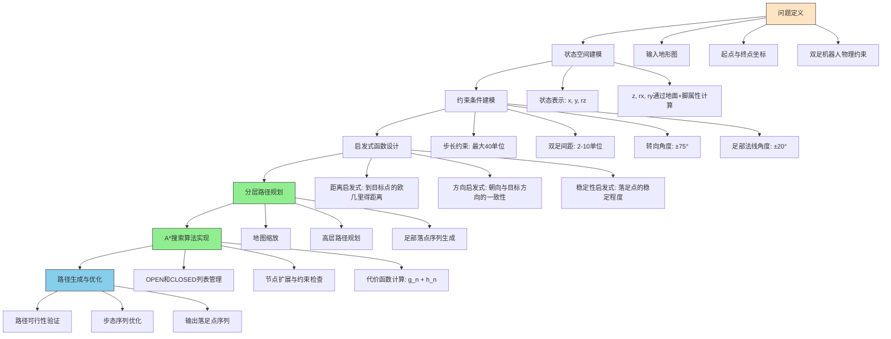

# 双足机器人路径规划问题分析与解决方案设计

## 1. 问题分析

### 1.1 问题背景

双足机器人在复杂地形中的行走是一个具有挑战性的问题。为了实现稳定行走，机器人需要根据地形特征规划合适的落足点，同时满足自身物理约束。

### 1.2 输入要素分析

- **地形图**: 1000×3000的灰度图像，表示三维地形
- **起点与终点**: 二维坐标投影
- **物理约束**:
  - 最大步长40单位
  - 双足间距2-10单位
  - 最大转向角±75°
  - 足部法线角度±20°

### 1.3 基本假设

1. 在足部接触地面发生偏转时，与地面接触面积不会发生改变。
2. 足部正方向与移动方向一致，即脚的朝向为当前脚的位置指向下一步脚的位置(存在激活步长，只有达到激活步长时，摆动脚正方向才会改变)。
3. 左右脚交替运动。
4. 腿长无限。

### 1.4 核心概念定义

- **引导点**：基于寻路算法得到的非直接作为路径的点
- **指向点**：基于引导点序列得到的作为移动方向确认的点

### 1.5 关键挑战

1. **状态空间复杂性**：需要考虑足部的位置(x, y)和朝向(rz)
2. **多重约束满足**：步长、双足间距、转向角和足部法线角度约束
3. **地形适应性**：需要根据地形特征动态调整落足点
4. **实时性要求**：作为在线规划算法，需要在有限时间内给出解决方案

## 2. 解决方案设计

### 2.1 状态空间建模

使用三元组(x, y, rz)定义一个脚的状态:

- **x, y**: 脚在地面上的投影坐标
- **rz**: 脚的朝向角（绕z轴旋转）

隐式计算属性:

- **z**: 脚的高度，通过地面高度查询获得
- **rx, ry**: 脚的倾斜角度，通过地面法线和脚的姿态计算获得

### 2.2 约束条件建模

#### 2.2.1 步长约束

- 最大步长限制为40单位
- 需要在搜索过程中过滤超过此限制的移动

#### 2.2.2 双足间距约束

- 双足间距必须保持在2-10单位之间
- 确保机器人稳定性

#### 2.2.3 转向角度约束

- 最大转向角限制为±75°
- 防止机器人足部过度扭转

#### 2.2.4 足部法线角度约束

- 足部法线与重力方向夹角不得超过±20°
- 确保足部与地面有良好的接触

### 2.3 算法选择与设计

#### 2.3.1 A*搜索算法

- 采用A*算法进行路径搜索
- 结合启发式函数优化搜索效率

#### 2.3.2 启发式函数设计

1. **距离启发式**: 到目标点的欧几里得距离
2. **方向启发式**: 朝向与目标方向的一致性
3. **稳定性启发式**: 落足点的稳定程度

### 2.4 分层路径规划

#### 2.4.1 地图缩放

- 对原始地图进行缩放处理
- 提高高层路径规划效率

#### 2.4.2 高层路径规划

- 在缩放后的地图上进行初步路径规划
- 生成引导点序列

#### 2.4.3 足部落点序列生成

- 基于引导点序列生成具体的足部落点
- 考虑机器人运动学约束

### 2.5 足部姿态计算与接触平面拟合

#### 2.5.1 足部覆盖区域计算

- 根据足部位置(x, y)和朝向角(rz)，计算足部矩形在地面坐标系中的实际覆盖范围
- 足部尺寸为3×5cm，需要考虑旋转后在地面网格上的实际覆盖区域
- 使用几何变换计算足部四个角点在世界坐标系中的位置
- 确定足部覆盖的所有地面网格单元

#### 2.5.2 地面数据采样

- 遍历足部覆盖区域内的所有地面网格点
- 获取每个网格点的高度值，构建局部地形点云数据
- 对于部分在足部边界上的网格点，根据覆盖面积比例进行加权处理

#### 2.5.3 接触平面计算

- 在足部覆盖区域内采用三点迭代算法计算最佳拟合平面
- 通过最小二乘法优化平面参数，使得平面与足部覆盖区域内的地面点尽可能贴合
- 计算足部坐标系与接触平面法向量之间的夹角，作为足部倾斜角度(rx, ry)

#### 2.5.4 稳定性评估

- 检查足部法向量与重力方向的夹角是否超过±20°的限制
- 评估足部与地面的接触面积和压力分布
- 根据地面材质和摩擦系数计算足部的滑动风险

#### 2.5.5 凸包检测备选方案

- 使用凸包算法确定足部与地面的实际接触区域
- 通过计算接触点集的凸包来确定稳定支撑区域
- 分析凸包的几何特性，评估足部的稳定性

## 3. 实现思路与技术方案

### 3.1 算法流程设计

### 3.2 核心数据结构

1. **SqDot**：二维点表示
2. **CuDot**：三维点表示
3. **SqPlain**：二维地图表示
4. **CuPlain**：三维平面表示

### 3.3 关键算法实现

#### 3.3.1 A*路径搜索算法

- 实现经典的A*搜索算法
- 集成机器人约束检查

#### 3.3.2 地图缩放算法

- 实现地图层次化表示
- 提高搜索效率

#### 3.3.3 足部姿态计算

- 计算足部在不同位置和朝向下的姿态
- 验证姿态是否满足约束条件

#### 3.3.4 地形平整度评估

- 评估局部地形的可行走性
- 为路径规划提供参考

## 4. 当前实现状态与后续计划

### 4.1 已实现功能

1. **基础数据结构**：
   - SqDot：二维点表示
   - CuDot：三维点表示
   - SqPlain：二维地图表示
   - CuPlain：三维平面表示

2. **核心算法**：
   - A*路径搜索算法
   - 地图缩放算法
   - 足部姿态计算
   - 地形平整度评估

3. **机器人模型**：
   - 双足机器人基本行为
   - 步态约束检查
   - 足部滑动优化

4. **测试框架**：
   - 单元测试框架
   - 集成测试用例
   - 自动化测试脚本

### 4.2 待完善功能

1. **主程序逻辑**：
   - 完善主程序流程
   - 实现完整的路径规划流程

2. **输出功能**：
   - 路径可视化
   - 数据导出功能
   - 图表生成功能

3. **性能优化**：
   - 算法性能调优
   - 内存使用优化
   - 并行计算支持

4. **扩展功能**：
   - 动态路径规划
   - 多机器人协调
   - 实时避障功能
